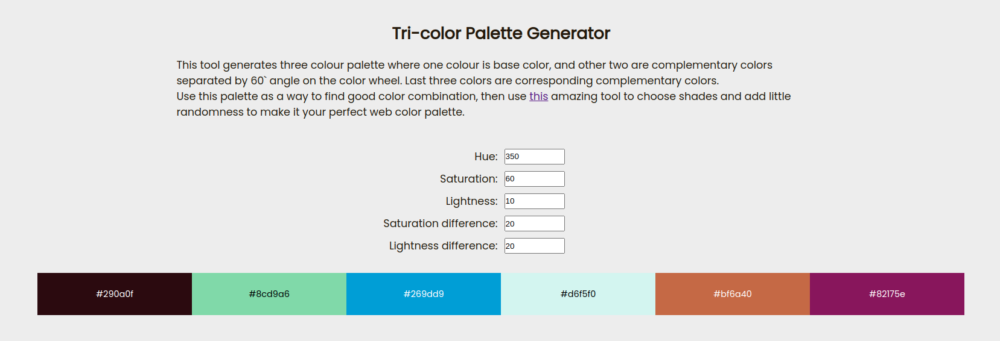

# Tri-color Palette Generator
This tool generates tri-colour palette where one colour is base color, and other two are complementary colors separated by 60` angle on the color wheel. Last three colors are corresponding complementary colors.

Live: <a href="https://himanshumittal01.github.io/tri-color-palette/">Tri-color palette</a>

Screenshot:

